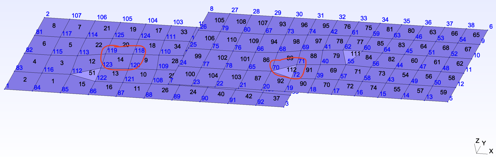
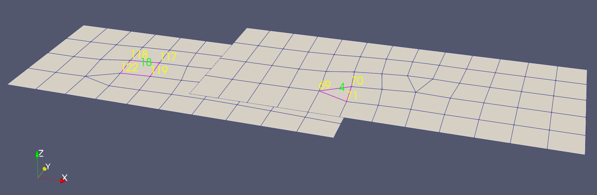
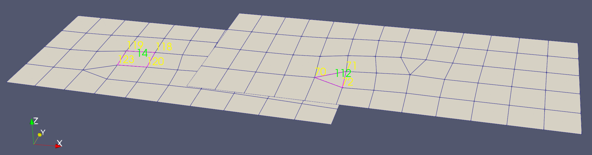
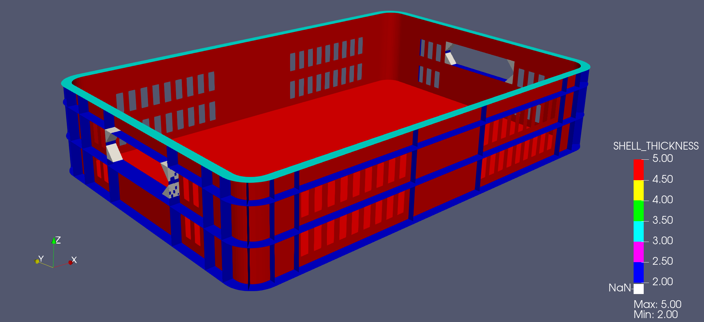

# Overview (still in development 🚧)
A python tool that converts a (general purpose) Finite Element Model to a VTK model for visualizing in ParaView.

Currently I will try to focus on converting ANSYS FE models and post-processing some results.


But still the focus will be in the future to convert also:
- Nastran (.bdf, .dat) / OptiStruct (.fem) containing `CQUAD4`,`CTRIA3`, `CHEXA`, `CPENTA` and `CTETRA (2nd order only)` elements
- Abaqus 

# Usage

```
==================================================
                     _     ____        _   _      
 _ __ ___   ___  ___| |__ |___ \__   _| |_| | __  
| '_ ` _ \ / _ \/ __| '_ \  __) \ \ / / __| |/ /  
| | | | | |  __/\__ \ | | |/ __/ \ V /| |_|   <   
|_| |_| |_|\___||___/_| |_|_____| \_/  \__|_|\_\  

==================================================
usage: mesh2vtk.py [-h] --inputfile INPUTFILE --outputfile OUTPUTFILE [--ascii] [--fem_node_string]
                   [--fem_element_string]

A python tool that converts a (general purpose) Finite Element Model to a VTK model

options:
  -h, --help            show this help message and exit
  --inputfile INPUTFILE
                        Path to the input file.
  --outputfile OUTPUTFILE
                        Path to the output vtu file.
  --ascii               Optional: Data mode of vtu file. BINARY set as default mode. If this argument is passed
                        data mode will be set to ASCII.
  --fem_node_string     Optional: Map FEM node id to vtu file.
  --fem_element_string  Optional: Map FEM element id to vtu file.
```

# Example of converted Finite Element Models to vtu

A simple test Nastran FE model was converted to a `vtu` model. 

The figure below shows the original Nastran model showing the node and element IDs.



Converted Nastran FEM to vtu **without** FEM node and element string mapping.



Converted Nastran FEM to vtu **with** FEM node and element string mapping (if `--fem_node_string` and/or `--fem_element_string` is passed to the CLI). 




Shell thicknesses can also been visualized as shown in the OptiStruct converted vtu model below. If 3D elements are also present the thickness values are set to NaN.

 


