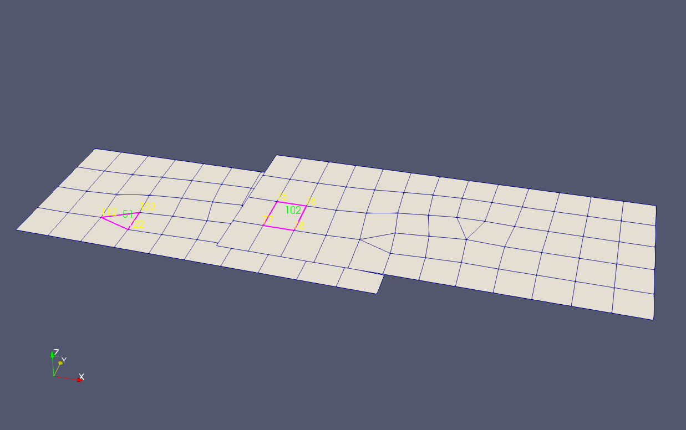

# Overview
A python tool that converts a general purpose FE model to a VTK model for visualizing in ParaView.

For now Nastran/OptiStruct `CQUAD4` and `CTRIA3` elements (.*bdf, *dat, *.fem) can be converted to a VTK model.

# Usage

The main file is `mesh2vtk.py`.

```
python mesh2vtk.py [input file] [output file]
```

# Example Output in ParaView

A test NASTRAN model was converted to a `*.vtu` model. The FE nodes and element string IDs have been mapped onto the VTK model.




