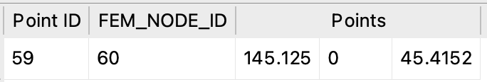

# **mesh2vtk: FEM to VTK Converter** (still in development 🚧)

`mesh2vtk` is a Python script that converts ANSYS Finite Element Model files (currently focused) into VTK Unstructured Grid (`.vtu`) files. This tool is designed for visualizing and analyzing FEM data in tools like ParaView.

---

## **Features**
- Converts FEM nodes and elements to VTK-compatible formats.
- Maps FEM node and element IDs to the `.vtu` file (optional).
- `.vtu` outputs in binary or ASCII format.

---

## **Installation**

### **Requirements**
- Python 3.8 or higher
- Python libraries:
  - `vtk`
  - `numpy`

Install the required libraries using:

```bash
pip install vtk numpy
```

---

## **Usage**

Run the script with the following options:

```bash
python mesh2vtk.py --inputfile INPUTFILE --outputfile OUTPUTFILE [options]
```

### **Options**
| **Option**                | **Description**                                                                 |
|---------------------------|---------------------------------------------------------------------------------|
| `--ascii`                 | Output the `.vtu` file in ASCII format (default is binary).                     |
| `--fem_node_string`       | Map FEM node IDs to the `.vtu` file.                                            |
| `--fem_element_string`    | Map FEM element IDs to the `.vtu` file.                                         |

### **Example**

```bash
python mesh2vtk.py --inputfile model.dat --outputfile model.vtu --ascii --fem_node_string --fem_element_string
```

This command:
- Reads `model.dat`.
- Outputs `model.vtu` in ASCII format.
- Includes FEM node and element IDs in the output.

---

## **Supported Element Types**

- Supports the following ANSYS element types:


| **Element Type**             | **Nodes** | **VTK Cell Type**        |
|-------------------------------|-----------|--------------------------|
| Solid 187 | 10        | Quadtratic Tetra (=24)    |
| Solid 186  | 20        | Quadratic Hexahedron (=25)     |
| Solid 185  | 8        | Hexahedron (=12)     |
| Solid 185  | 4        | Tetra (=10)     |
| Shell 181  | 4        | Quad (=9)     |
| Shell 181  | 3        | Triangle (=5)     |

---

## **Output Details**

- The `.vtu` file contains (example):
  - **Points**
 
  - **Cells**:. 
 

  - **Attributes** (optional):
    - FEM node IDs (`FEM_NODE_ID`).
    - FEM element IDs (`FEM_ELEMENT_ID`).

    Without FEM node and element string mapping:
    

    With FEM node and element string mapping:
     

---

## **VTK Summary**

The script outputs key statistics about the generated `.vtu` file, including:
- Number of points (nodes).
- Number of cells (elements).
- Output file directory and file name

 


---

## **Performance**
Execution time is displayed at the end of the run, providing insight into processing efficiency.

---

## **Acknowledgments**
Built using:
- [ANSYS Student Version](https://www.ansys.com/de-de/academic/students)
- [VTK](https://vtk.org/)
- [ParaView](https://www.paraview.org)


For feedback or contributions, feel free to create an issue or submit a pull request.
